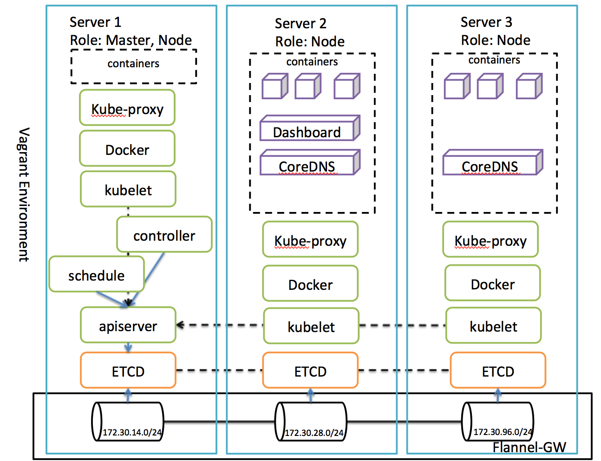

# Setting up a kubernetes cluster with Vagrant
Using vagrant file to build a kubernetes cluster which consists of 1 master(also as role) and 3 nodes. You don't have to create complicated ca files or configuration.

### Why don't do that with kubeadm

Because I want to setup the etcd, apiserver, controller, scheduler without docker container.

### Architecture




### Cluster network
The default setting will create the private network from 172.17.8.101 to 172.17.8.103 for nodes, and it will use the host's dhcp for the public ip

The kubenetes service's vip range is 10.254.0.0/16

The container network range is 170.30.0.0/30 owned by flanneld with GW mode

### Usage

#### Prerequisite
* Host server with 8G+ mem(More is better), 60G disk, 8 core cpu at lease
* vagrant 2.0+
* virtualbox 5.0+
* Maybe need to access the internet through GFW to download the kubernetes files

### Support Addon

- CoreDNS
- Dashboard

#### Setup
```bash
git clone https://github.com/duffqiu/centos-vagrant.git
cd kubernetes-vagrant-centos
vagrant up
```

#### Connect to kubernetes

```bash
vagrant ssh node1
sudo -i
kubectl get nodes
```

## Clean

```bash
vagrant destroy
rm -rf .vagrant
```

#### Note

Don't use it in production environment

#### Reference

* [Kubernetes Handbook](https://jimmysong.io/kubernetes-handbook/)

